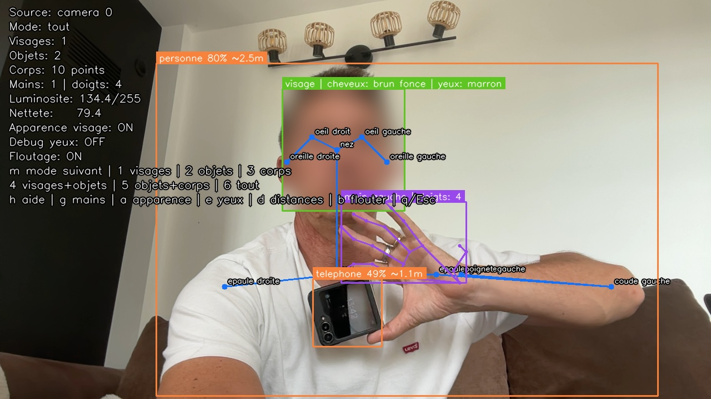

# Visio Camera Analyzer

Petit projet local pour analyser le flux de la camera du Mac avec des modeles pre-entraines de detection de visage, reconnaissance d'objets et estimation de points du corps.

Le projet detecte les visages, reconnait des objets courants, affiche des points du corps, et peut flouter les visages avant de sauvegarder une capture. Il n'infere pas l'ethnie, le sexe/genre, l'age ou la couleur de peau depuis le visage : ces attributs sont sensibles, peu fiables a estimer visuellement, et ne doivent pas etre deduits automatiquement depuis une camera.

## Fonctionnalites

- Capture video locale depuis la webcam du Mac.
- Sources alternatives : image, video, flux reseau, ecran entier/zone, fenetre macOS.
- Detection de visages via le cascade Haar pre-entraine fourni par OpenCV.
- Estimation approximative de la couleur des cheveux et des yeux en mode visage.
- Reconnaissance d'objets via YOLOv4-tiny pre-entraine sur COCO avec OpenCV DNN.
- Estimation approximative de distance des objets a partir de leur taille apparente.
- Mode legacy MobileNet-SSD toujours disponible.
- Detection des parties du corps via OpenPose COCO : nez, cou, epaules, coudes, poignets, hanches, genoux, chevilles, yeux, oreilles.
- Detection des mains et comptage approximatif des doigts visibles via OpenPose main.
- Affichage de cadres de detection et du nombre de visages.
- Metriques image non sensibles : luminosite moyenne et score de nettete.
- Mode floutage des visages.
- Sauvegarde volontaire de captures anonymisees.

## Exemple



Capture du mode `all` avec detection de visage floute, objets, distance approximative, points du corps, main et comptage des doigts visibles.

## Installation

```bash
python3 -m venv .venv
source .venv/bin/activate
python -m pip install -U pip
python -m pip install -e .
```

## Lancement

```bash
visio-camera
```

Par defaut, l'application lance le mode visage historique. Pour la reconnaissance d'objets plus large, telecharge d'abord YOLO/COCO :

```bash
visio-camera --download-object-model
```

Puis lance :

```bash
visio-camera --mode objects
```

Pour detecter les parties du corps, telecharge OpenPose/COCO :

```bash
visio-camera --download-pose-model
```

Pour ajouter la detection des mains et le comptage des doigts dans les modes `pose`, `objects-pose` et `all` :

```bash
visio-camera --download-hand-model
```

Puis lance :

```bash
visio-camera --mode pose
```

Pour combiner objets et points du corps :

```bash
visio-camera --mode objects-pose
```

Pour garder le floutage visage et ajouter les objets :

```bash
visio-camera --mode both
```

Pour tout afficher ensemble :

```bash
visio-camera --mode all
```

## Sources

La source par defaut reste la camera :

```bash
visio-camera --source camera --camera-index 0
```

Analyser une image :

```bash
visio-camera --source image --input chemin/vers/image.jpg --mode objects
```

Analyser une video :

```bash
visio-camera --source video --input chemin/vers/video.mp4 --mode objects-pose
```

Relancer la video en boucle :

```bash
visio-camera --source video --input chemin/vers/video.mp4 --loop
```

Analyser un flux reseau :

```bash
visio-camera --source stream --input rtsp://adresse-du-flux --mode objects
```

Cela fonctionne aussi avec les flux `http://`, `https://` ou certains flux `rtmp://` si OpenCV/FFmpeg sait les ouvrir.

Analyser l'ecran :

```bash
visio-camera --source screen --screen-index 1 --mode objects
```

Analyser une zone de l'ecran :

```bash
visio-camera --source screen --screen-region 0,0,1280,720 --mode all
```

Lister les fenetres macOS visibles :

```bash
visio-camera --list-windows
```

Analyser une fenetre macOS par identifiant :

```bash
visio-camera --source window --window-id 12345 --mode objects
```

Ou par une partie du titre/proprietaire :

```bash
visio-camera --source window --window-title Safari --mode objects
```

## Lunettes Meta

Les lunettes Ray-Ban Meta ne sont generalement pas exposees a macOS comme une webcam standard. Le projet supporte donc plusieurs chemins d'entree, selon ce que ton setup rend disponible :

- Si tu obtiens une URL de flux via une passerelle, OBS, RTSP, NDI converti en URL, ou un outil mobile : `visio-camera --source stream --input URL`.
- Si le flux des lunettes est visible dans une app ou une page web sur le Mac : `visio-camera --source window --window-title NOM`.
- Si la fenetre n'est pas listable : `visio-camera --source screen --screen-region x,y,largeur,hauteur`.
- Si tu transformes le flux en webcam virtuelle avec OBS ou un outil equivalent : `visio-camera --source camera --camera-index N`.

Exemple avec une fenetre :

```bash
visio-camera --source window --window-title "Meta" --mode objects-pose
```

Exemple avec un flux reseau :

```bash
visio-camera --source stream --input rtsp://192.168.1.50:8554/live --mode all
```

Si macOS refuse l'acces camera, autorise ton terminal dans :

`Reglages Systeme > Confidentialite et securite > Appareil photo`

Si tu vois encore un refus d'acces apres avoir autorise la camera, relance la commande depuis le meme terminal que celui qui a l'autorisation macOS.

Pour les sources `screen` et `window`, macOS peut demander l'autorisation :

`Reglages Systeme > Confidentialite et securite > Enregistrement de l'ecran`

## Raccourcis

- `q` ou `Esc` : quitter.
- `h` : afficher/masquer la liste des raccourcis.
- `m` : passer au mode suivant.
- `1` : mode visages.
- `2` : mode objets.
- `3` : mode corps.
- `4` : mode visages + objets.
- `5` : mode objets + corps.
- `6` : mode tout.
- `g` : activer/desactiver la detection des mains en mode pose.
- `a` : afficher/masquer l'estimation cheveux/yeux en mode visage.
- `e` : afficher/masquer les zones utilisees pour estimer la couleur des yeux.
- `d` : afficher/masquer les distances estimees des objets.
- `b` : activer/desactiver le floutage des visages.
- `s` : sauvegarder une capture dans `snapshots/`.

## Options

```bash
visio-camera --mode objects-pose --camera-index 0 --object-confidence 0.35 --pose-confidence 0.12
```

- `--mode faces|objects|pose|both|objects-pose|all` : choisit l'analyse a effectuer.
- `--source camera|image|video|stream|screen|window` : choisit la source.
- `--input` : chemin image/video ou URL de flux.
- `--camera-index` : index OpenCV de la camera, souvent `0` sur Mac.
- `--loop` : relance une video en boucle.
- `--screen-index` : ecran capture par `mss`, `1` par defaut.
- `--screen-region x,y,largeur,hauteur` : zone precise a capturer.
- `--source-fps` : cadence cible des sources ecran/fenetre.
- `--list-windows` : liste les fenetres macOS visibles.
- `--window-id` : capture une fenetre macOS par ID.
- `--window-title` : capture la premiere fenetre dont le titre/proprietaire contient ce texte.
- `--scale` : facteur de reduction pour la detection, utile si la machine rame.
- `--face-appearance` / `--no-face-appearance` : affiche ou masque l'estimation cheveux/yeux.
- `--eye-debug` : affiche les zones d'echantillonnage des yeux.
- `--object-confidence` : score minimum pour afficher un objet.
- `--object-detector yolo|mobilenet` : choisit le detecteur objet.
- `--object-nms` : seuil de fusion des boites YOLO redondantes.
- `--distance-estimates` / `--no-distance-estimates` : affiche ou masque les distances estimees.
- `--focal-length-px` : focale en pixels utilisee pour la formule de distance.
- `--distance-reference LABEL=AXIS:METERS` : remplace la taille reelle d'un objet.
- `--pose-confidence` : score minimum pour afficher un point du corps.
- `--pose-height` : precision/vitesse d'OpenPose, par defaut `256`.
- `--hands` / `--no-hands` : active ou desactive la detection des mains en mode pose.
- `--hand-prototxt` : chemin du fichier prototxt OpenPose main.
- `--hand-model` : chemin du fichier caffemodel OpenPose main.
- `--max-hands` : nombre maximal de mains a detecter.
- `--hand-confidence` : score minimum pour afficher un point de main.
- `--hand-input-size` : precision/vitesse d'OpenPose main, par defaut `256`.
- `--hand-roi-scale` : taille de la zone analysee autour de chaque poignet.
- `--download-object-model` : telecharge le modele objet selectionne dans `models/`.
- `--download-pose-model` : telecharge OpenPose COCO dans `models/`.
- `--download-hand-model` : telecharge OpenPose main dans `models/`.
- `--download-all-models` : telecharge YOLO/COCO, OpenPose/COCO et OpenPose mains.
- `--no-window` : analyse sans fenetre graphique, pratique pour verifier que la camera s'ouvre.
- `--frames 30` : quitte automatiquement apres 30 images.

## Objets reconnus

Le detecteur objet par defaut est YOLOv4-tiny entraine sur COCO. Les objets sont affiches en francais. Il reconnait 80 classes, notamment :

`personne`, `velo`, `voiture`, `moto`, `bus`, `train`, `camion`, `bateau`, `feu tricolore`, `banc`, `chat`, `chien`, `cheval`, `sac a dos`, `parapluie`, `bouteille`, `tasse`, `fourchette`, `couteau`, `chaise`, `canape`, `lit`, `ordinateur portable`, `souris`, `clavier`, `telephone`, `livre`, `horloge`, `brosse a dents`.

MobileNet-SSD reste disponible avec :

```bash
visio-camera --object-detector mobilenet --mode objects
```

## Apparence visage

En mode visage, le programme peut afficher une estimation approximative :

```text
visage | cheveux: brun | yeux: bleu
```

L'estimation utilise des zones visuelles simples autour du visage et des yeux. Elle depend fortement de l'eclairage, de la resolution, des lunettes, de la coiffure et du cadrage.

Commandes :

```bash
visio-camera --mode faces
```

```bash
visio-camera --mode faces --no-face-appearance
```

Pour diagnostiquer la couleur des yeux :

```bash
visio-camera --mode faces --eye-debug
```

Les petits rectangles cyan doivent tomber sur l'iris. Si les rectangles tombent sur les paupieres, les lunettes, le blanc de l'oeil ou trop loin du visage, la couleur affichee sera peu fiable.

La couleur de peau n'est pas classifiee. Si tu veux travailler sur la colorimetrie de l'image, privilegie une palette ou un echantillonnage manuel de zone, sans etiqueter une personne.

## Distance des objets

En mode objet, le programme estime la distance avec :

```text
distance ~= focale_px * taille_reelle_m / taille_apparente_px
```

Les tailles reelles par defaut sont des ordres de grandeur par classe COCO. Par exemple, une personne utilise la hauteur detectee, une voiture utilise la largeur detectee, une bouteille utilise la hauteur detectee.

Exemples :

```bash
visio-camera --mode objects --focal-length-px 900
```

```bash
visio-camera --mode objects --distance-reference bouteille=hauteur:0.28
```

```bash
visio-camera --mode objects --distance-reference car=width:1.90
```

Pour calibrer plus proprement, place un objet de taille connue a une distance connue, mesure sa taille en pixels dans l'image, puis calcule :

```text
focale_px = distance_m * taille_apparente_px / taille_reelle_m
```

La mesure reste approximative : si l'objet est tourne, partiellement cache, ou si sa taille reelle varie beaucoup, la distance sera seulement indicative.

## Points du corps

Le mode `pose` utilise OpenPose COCO et affiche jusqu'a 18 points en francais : `nez`, `cou`, `epaule droite`, `coude droit`, `poignet droit`, `epaule gauche`, `coude gauche`, `poignet gauche`, `hanche droite`, `genou droit`, `cheville droite`, `hanche gauche`, `genou gauche`, `cheville gauche`, `oeil droit`, `oeil gauche`, `oreille droite`, `oreille gauche`.

Quand `--hands` est actif, le mode `pose` ajoute les mains detectees autour des poignets et affiche un compteur approximatif des doigts visibles pour chaque main. Si aucun poignet n'est detecte, il tente aussi une detection de main sur l'image entiere. Tu peux le couper avec :

```bash
visio-camera --mode pose --no-hands
```

Sources des modeles :

- YOLOv4-tiny/COCO : repository `AlexeyAB/darknet`.
- OpenPose COCO : sample OpenCV DNN et modele OpenPose.
- OpenPose main : sample OpenCV DNN et modele OpenPose.
- MobileNet-SSD legacy : repository `chuanqi305/MobileNet-SSD`.

## Note importante

Ce squelette est volontairement limite a de la detection et a de l'analyse non sensible. Il ne fait pas d'estimation d'age, d'ethnie, de sexe/genre ou de couleur de peau depuis les visages. Pour un usage produit, ajoute un consentement explicite, une indication visible quand la camera tourne, et evite toute conservation d'image par defaut.
